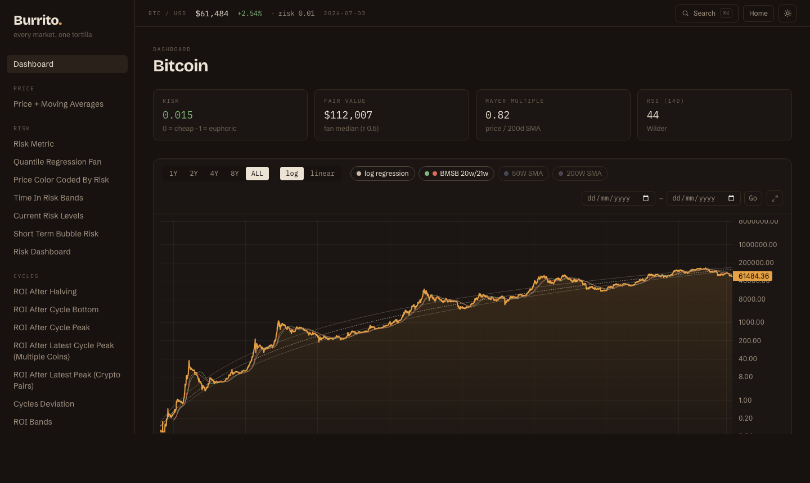
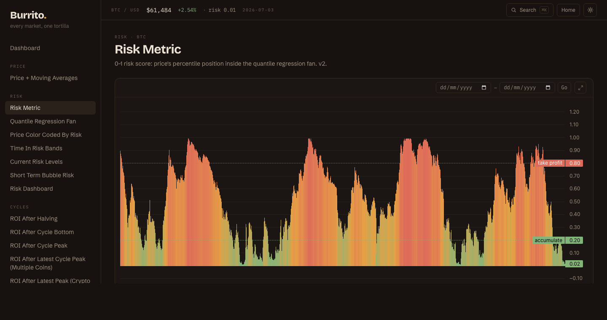
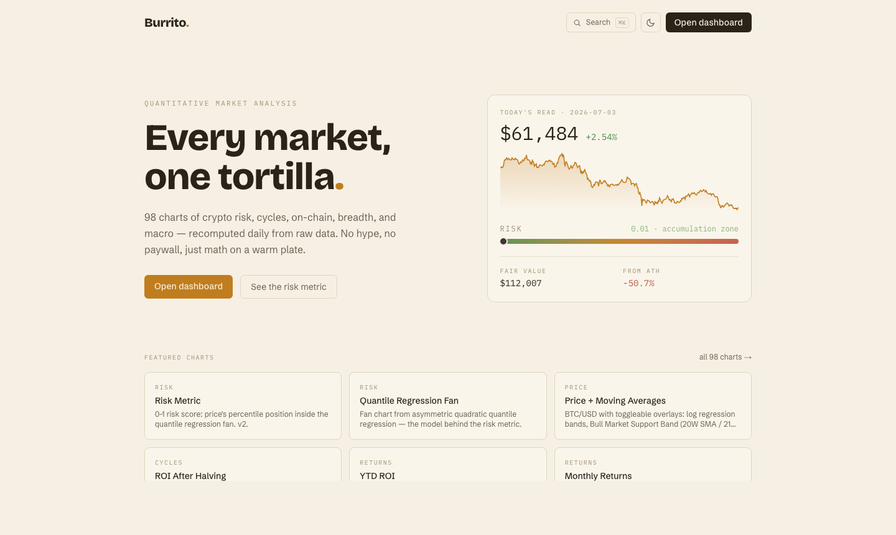
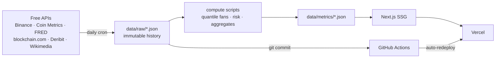

<div align="center">

# 🌯 Burrito

**every market, one tortilla**

A self-updating quantitative market-analysis site — 98 charts of crypto risk, cycles,
on-chain, breadth, derivatives, and US macro. Recomputed daily. Running cost: **$0/month**.

**[burrito-finance.vercel.app](https://burrito-finance.vercel.app)**

   



</div>

## What is this?

A personal clone of the paid crypto-analytics platforms — built solo in a few days with
[Claude Code](https://claude.com/claude-code), on entirely free data. Highlights:

- **Own risk model** — a 0–1 risk metric read from an asymmetric quadratic **quantile
  regression fan** fitted to each asset's full history (independently implemented; scores
  the 2013/2017/2021 tops at 0.98–0.99 and the 2022 bottom at 0.01)
- **Risk dashboard** across 27 assets — each with its own fitted fan, Mayer Multiple,
  and trend state
- **98 charts** in 13 categories: price/cycles/TA, on-chain (MVRV, NUPL, Puell, hash
  ribbons), market structure (dominance, SSR, breadth, correlations), derivatives,
  sentiment, and a full US-macro section (FRED)
- **Every chart teaches** — each page has an "understanding this chart" section
- **⌘K search**, dark/light themes, mobile drawer, date-range zoom, fullscreen charts
- **Fully self-updating**: a GitHub Actions cron fetches data, recomputes every metric
  (including refitting the quantile fans), commits, and Vercel redeploys — daily, unattended

<div align="center">
 
</div>

## Architecture

The whole design rests on one observation: **everything here is daily-granularity data**,
so the site never needs a live API. Fetch once a day, compute, serve static files.



- **Storage is flat JSON in the repo** — ~40MB total, every daily update is a reviewable diff
- **Backfill scripts** run once; **update scripts** append only closed UTC candles; gaps
  self-heal (a missed cron day is caught up by the next run)
- **Derivatives use collect-forward**: Binance exposes only 30 days, so history accumulates
- The site is fully static — visitors never trigger an API call, and rate limits can't break it

## Run it yourself

```bash
git clone https://github.com/srivathsanvenkateswaran/Burrito.git && cd Burrito
npm install
npm run data:backfill && npm run data:assets   # one-time history (or just use the committed data)
npm run dev
```

Optional: a free [FRED API key](https://fred.stlouisfed.org/docs/api/api_key.html) in
`.env.local` (`FRED_API_KEY=...`) enables the macro fetchers. The daily cron needs the same
key as a GitHub Actions secret.

## Data sources & credits

| Source | Used for |
|---|---|
| [Binance](https://binance.com) (spot + futures) | daily OHLCV for 27 assets, open interest, long/short |
| [Coin Metrics community API](https://coinmetrics.io/community-network-data/) | market caps, on-chain metrics (MVRV, addresses, fees, exchange flows) |
| [blockchain.com](https://www.blockchain.com/explorer/api) | hash rate, miner revenue, BTC network stats |
| [FRED](https://fred.stlouisfed.org) (St. Louis Fed) | 24 US macro series |
| [Deribit](https://www.deribit.com) | options open interest |
| [alternative.me](https://alternative.me/crypto/fear-and-greed-index/) | Fear & Greed index |
| [Wikimedia](https://wikimedia.org/api/rest_v1/) | Wikipedia pageviews |
| [CoinGecko](https://www.coingecko.com) | supply snapshots for market-cap estimates |

Indicator credits where due: Mayer Multiple (Trace Mayer), Pi Cycle (Philip Swift),
Hash Ribbons (Charles Edwards), Puell Multiple (David Puell), RSI (J. Welles Wilder),
Bull Market Support Band terminology (Benjamin Cowen).

## Inspiration & disclaimers

Burrito is **inspired by [Into The Cryptoverse](https://intothecryptoverse.com)** — the
chart catalog owes its scope to what Benjamin Cowen's platform pioneered. Everything here
is independently implemented from public data and published methods; no ITC data, code, or
proprietary models are used, and our numbers intentionally differ.

**Not financial advice. Just a burrito.** 🌯

## License

MIT — see [LICENSE](LICENSE). The code is yours to fork; the data belongs to its sources
(see their terms before commercial use).
