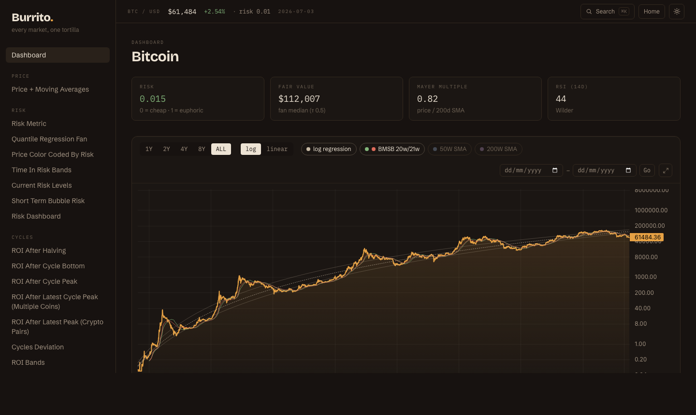
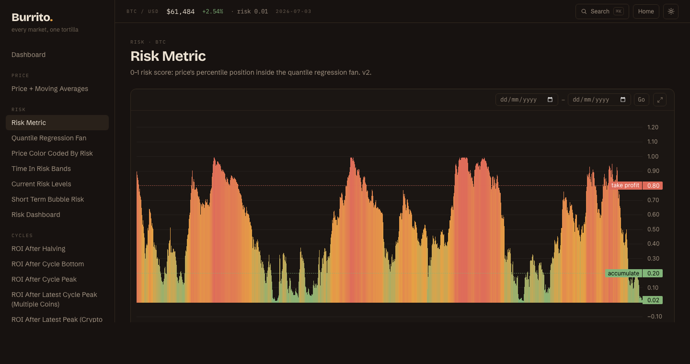
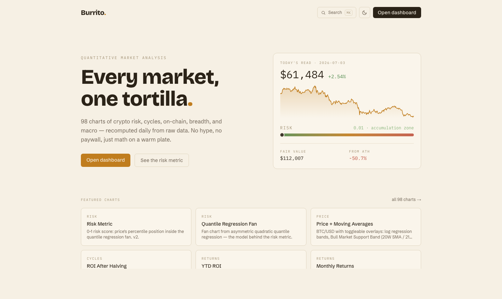
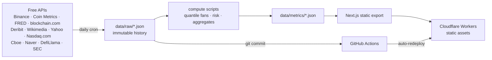

<div align="center">

# 🌯 Burrito

**every market, one tortilla**

A self-updating quantitative market-analysis site — 104 charts of price, risk, cycles,
on-chain activity, breadth, derivatives, and US macro, run across crypto, equities and
indices. Recomputed daily. Running cost: **$0/month**.

**[burrito-finance.srivathsanvenkateswaran.workers.dev](https://burrito-finance.srivathsanvenkateswaran.workers.dev)**

   



</div>

## The 55-second tour

https://github.com/srivathsanvenkateswaran/Burrito/raw/main/.github/media/launch-video.mp4

*(The launch video itself was built with AI — written as HTML compositions in burrito's own design
tokens and rendered to MP4 with [HyperFrames](https://github.com/heygen-com/hyperframes), one
agent per scene.)*

## What is this?

A personal clone of the paid crypto-analytics platforms — built solo in a few days with
[Claude Code](https://claude.com/claude-code), on entirely free data. Highlights:

- **Own risk model** — a 0–1 risk metric read from an asymmetric quadratic **quantile
  regression fan** fitted to each asset's full history (independently implemented; scores
  the 2013/2017/2021 tops at 0.98–0.99 and the 2022 bottom at 0.01)
- **Multi-asset suite** — the same fan/risk/cycle/TA treatment runs on 33 full-suite
  assets: Bitcoin, Ethereum, Solana, 27 equities (Apple, Nvidia, TSMC, the AI-power names)
  and 3 indices (S&P 500, Nasdaq-100, Nasdaq Composite), each with its own dashboard at
  `/assets/<id>`
- **Per-asset fan and dashboard** — every full-suite asset gets its own fitted quantile
  fan, Mayer Multiple, RSI, moving averages, and cycle/drawdown history, not just a scalar
  row in a table; the other 27 tradeable coins keep the lighter risk-dashboard treatment
- **Cross-asset correlations** — rolling and point-in-time correlation between crypto and
  equities (BTC vs SPX, BTC vs NVDA, and more), plus normalized crypto-vs-equities
  comparisons
- **104 charts** in 16 categories: price/cycles/TA, on-chain (MVRV, NUPL, Puell, hash
  ribbons), market structure (dominance, SSR, breadth, correlations), derivatives,
  sentiment, and a full US-macro section (FRED)
- **Every chart teaches** — each page has an "understanding this chart" section
- **⌘K search**, dark/light themes, mobile drawer, date-range zoom, fullscreen charts
- **Fully self-updating**: a GitHub Actions cron fetches data, recomputes every metric
  (including refitting the quantile fans), commits, and redeploys to Cloudflare Workers —
  daily, unattended

<div align="center">
 
</div>

## Architecture

The whole design rests on one observation: **everything here is daily-granularity data**,
so the site never needs a live API. Fetch once a day, compute, serve static files.


```mermaid
flowchart LR
    A[Free APIs<br/>Binance · Coin Metrics · FRED · blockchain.com<br/>Deribit · Wikimedia · Yahoo · Nasdaq.com<br/>Cboe · Naver · DefiLlama · SEC] -->|daily cron| B[data/raw/*.json<br/>immutable history]
    B --> C[compute scripts<br/>quantile fans · risk · aggregates]
    C --> D[data/metrics/*.json]
    D --> E[Next.js static export]
    E --> F[Cloudflare Workers<br/>static assets]
    B -->|git commit| G[GitHub Actions] -->|auto-redeploy| F
```

- **Storage is flat JSON in the repo** — ~40MB total, every daily update is a reviewable diff
- **Backfill scripts** run once; **update scripts** append only closed UTC candles; gaps
  self-heal (a missed cron day is caught up by the next run)
- **Derivatives use collect-forward**: Binance exposes only 30 days, so history accumulates
- The site is fully static — visitors never trigger an API call, and rate limits can't break it

## Run it yourself

```bash
git clone https://github.com/srivathsanvenkateswaran/Burrito.git && cd Burrito
npm install
npm run data:backfill && npm run data:assets           # one-time crypto history (or just use the committed data)
npm run data:backfill-equities                          # one-time equity/index history
npm run data:compute && npm run data:compute-assets
npm run dev
```

Optional: a free [FRED API key](https://fred.stlouisfed.org/docs/api/api_key.html) in
`.env.local` (`FRED_API_KEY=...`) enables the macro fetchers. The daily cron needs the same
key as a GitHub Actions secret.

`data:backfill-equities` pulls from Yahoo Finance, which 429s requests from outside the
US — expect it to fall back to Nasdaq.com's 10-year window when run locally from a
non-US IP. The `backfill-equities.yml` GitHub Actions workflow (manual trigger) runs the
same script from a US-based runner and commits full listing history; see
[docs/data-pipeline.md](docs/data-pipeline.md) for the fallback chain.

## Deploying

The site is a Next.js static export (`output: "export"`) served straight from Cloudflare
Workers' static-assets host — no server, no functions. `deploy.yml` deploys on every push
to `main` that touches app or data code, and `daily-update.yml` redeploys after each cron
run (even on a no-op data day). Both need two repo secrets:

- `CLOUDFLARE_API_TOKEN` — a token scoped to `Workers Scripts:Edit`
- `CLOUDFLARE_ACCOUNT_ID` — your Cloudflare account ID

Locally, `npm run preview:cf` builds nothing by itself — run `npm run build` first, then
`npm run preview:cf` to serve `out/` through `wrangler dev` the same way Cloudflare would.
`npm run deploy:cf` pushes the current `out/` directly, for a manual deploy outside CI.

Static asset requests on Workers are free and unlimited on the free tier, so the
$0/month running cost carries over unchanged from the old Vercel hosting.

## Data sources & credits

| Source | Used for |
|---|---|
| [Binance](https://binance.com) (spot + futures) | daily OHLCV for 27 coins, open interest, long/short |
| [Coin Metrics community API](https://coinmetrics.io/community-network-data/) | market caps, on-chain metrics (MVRV, addresses, fees, exchange flows) |
| [blockchain.com](https://www.blockchain.com/explorer/api) | hash rate, miner revenue, BTC network stats |
| [Yahoo Finance](https://finance.yahoo.com) | daily OHLCV + adjusted close for 27 equities and 3 indices, full listing history |
| [Nasdaq.com](https://www.nasdaq.com) | equity/index OHLCV fallback when Yahoo rate-limits (10-year window) |
| [Cboe](https://www.cboe.com) | S&P 500 close-only history fallback, 1975 onward |
| [Naver Finance](https://finance.naver.com) | Samsung Electronics (005930) daily OHLCV in KRW |
| [DefiLlama](https://defillama.com) | USDT circulating supply |
| [SEC EDGAR (XBRL)](https://www.sec.gov/edgar/sec-api-documentation) | shares outstanding for equity market cap |
| [FRED](https://fred.stlouisfed.org) (St. Louis Fed) | 24 US macro series |
| [Deribit](https://www.deribit.com) | options open interest |
| [alternative.me](https://alternative.me/crypto/fear-and-greed-index/) | Fear & Greed index |
| [Wikimedia](https://wikimedia.org/api/rest_v1/) | Wikipedia pageviews |
| [CoinGecko](https://www.coingecko.com) | supply snapshots for market-cap estimates |

Indicator credits where due: Mayer Multiple (Trace Mayer), Pi Cycle (Philip Swift),
Hash Ribbons (Charles Edwards), Puell Multiple (David Puell), RSI (J. Welles Wilder),
Bull Market Support Band terminology (Benjamin Cowen).

## Inspiration & disclaimers

Burrito is **inspired by [Into The Cryptoverse](https://intothecryptoverse.com)** — the
chart catalog owes its scope to what Benjamin Cowen's platform pioneered. Everything here
is independently implemented from public data and published methods; no ITC data, code, or
proprietary models are used, and our numbers intentionally differ.

**Not financial advice. Just a burrito.** 🌯

## License

MIT — see [LICENSE](LICENSE). The code is yours to fork; the data belongs to its sources
(see their terms before commercial use).
